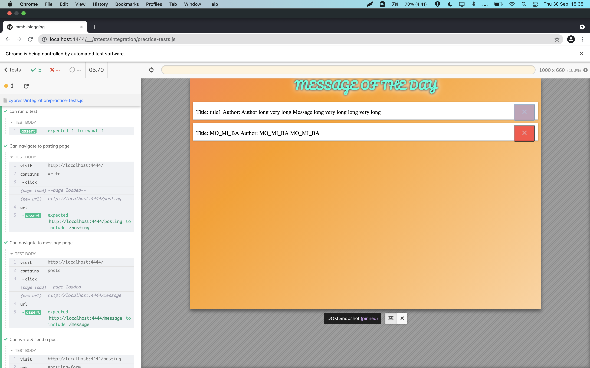
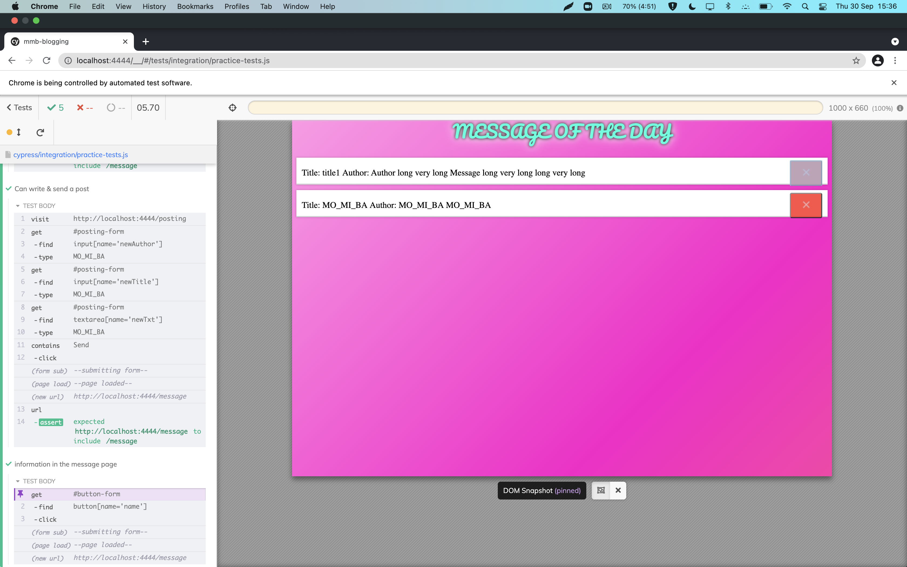

# Mistakes and learnings

## Issues

 - Every time we refreshed the page on the page we display our messages, it would repeat. We found that the problem was a scoping issue. 

```javascript
// Scoping: declare fresh list outside or inside server.get()

// <- used to be here
server.get("/message", (request, response) => {
  let items = ""; // <- items was defined in the wrong place
  for (const message of messageList) {
    // items += `<li>${message}</li>`;
    items += `<li>...</li>`;
  }
  const html = `...<ul>${items}</ul>`;

  response.end(html);
});

```

- Another issue we had was deleting the correct message. We got the correct item in the list every time but the item wasn't deleting on the page.

```javascript

server.post("/delete-message", bodyParser, (request, response) => {
  const textToDelete = request.body.name;
  console.log("Hello");
  console.log(textToDelete);
  delete messageList[textToDelete];


```

- Another issue was removing messages with more than one word. 
```javascript

const objListMessages = {
  hey: { text: "hey" },
  hello: { text: "hello" },
  "new message": { text: "new message" }, <- The "new message" key used to be called new, which was giving us problems
};

```


- We had another issue accessing the object to add a new value

```javascript
const bodyParser = express.urlencoded({ extended: false });
server.post("/posting", bodyParser, (request, response) => {
  const newMessage = request.body;
  const name = newMessage.text.toLowerCase(); <- we didn't have name variable before
  messageList[name] = newMessage;
```

- Big question: do we set up the list as an object or an array?


 ### How do we style without an index.html file?

We could create style tags within html in the javascript file, but that wouldn't be efficient. 

The answer is through static files in express. 

We create a new directory `public` with a folder called `css` in which we store our `style.css` file.

Here's our code:

```javascript

const staticHandler = express.static("public"); <- Have to create a static handler to access `public`

const server = express();

server.use(staticHandler);
///this is the home page
server.get("/", (request, response) => {
  const html = `
    <!DOCTYPE html>
      <html lang="en">
      <head>
        <meta charset="UTF-8">
        <meta http-equiv="X-UA-Compatible" content="IE=edge">
        <meta name="viewport" content="width=device-width, initial-scale=1.0">
       
        <link rel="stylesheet" type="text/css" href="./style.css"> <- Don't need to include the `public` directory

        <title>Message</title>
      </head>
      <body>
        <h1>Main page</h1>
        <p><a href="http://localhost:4444/posting">Message Board</a></p>
        

      </body>
      </html>
    `;

```
---

- We also wanted to add more details to our messages. Things like user name and title of the message.

Below what we had prev
```html
<!-- OLD Message -->
      <label for="text">Message</label>
      <input
        type="text"
        id="text"
        name="text"
        placeholder="Please type your message"
      />

```

```html
<form method="POST">
      <!-- // Author -->
      <label for="new-author">User name</label>
      <input
        type="text"
        id="new-author"
        name="new-author"
        placeholder="Choose your unique user name"
      />

      <!-- Title -->
      <label for="new-title">Title</label>
      <input
        type="text"
        id="new-title"
        name="new-title"
        placeholder="Your post title"
      />

      <!-- New Message -->
      <label for="new-txt">Message</label>
      <textarea
        type="text"
        id="new-txt"
        name="new-txt"
        placeholder="What's on your mind?"
      ></textarea>

```

### Testing
- Cypress doesn't work, but using VSCode LiveShare lets non-Mac users write the tests, their Mac-partner can then run it in Cypress
- Testing a **form**: 
  - If the HTML has fields with `<required>`
  - In `test.js`, a test if correct redirect address won't work for an empty form, need to fill in the fields in the test
  ```js
    it("Can write & send a post", () => {
      cy.visit("http://localhost:4444/posting");
      cy.get("#posting-form").find("input[name='newAuthor']").type("MO_MI_BA");
      cy.get("#posting-form").find("input[name='newTitle']").type("MO_MI_BA");
      cy.get("#posting-form").find("textarea[name='newTxt']").type("MO_MI_BA");
      cy.contains("Send").click();
      cy.url().should("include", "/message");
    });
  ```

  ### cypress issues

The Chrome Browser has a safety-feature. Then Cypress tests redirecting to different URLs won't work.
Fix it in `cypress.json`:

```json
  {
    "chromeWebSecurity": false
  }
```







## Fixing issues

 - Closes **#9** & **#15** - deployed to Heroku!
 - Closes **#20**  - fixed the textarea spacing for entering a new message

 - Closes **#7** & **#19** - fixed mobile responsiveness and overlapping

 - Closes **#13** - made an 100-character limit on messages

 - Closes **#11** - created a link on the message board to make new posts
